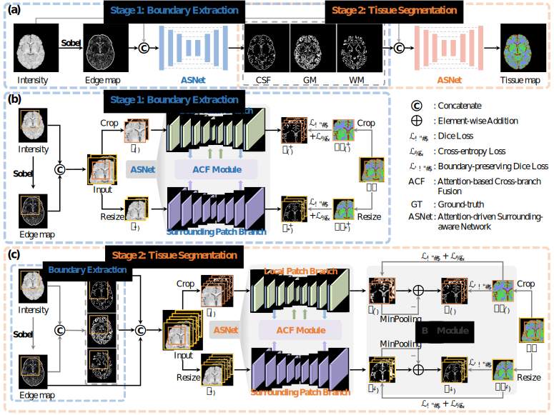

# Infant Brain Tissue Segmentation (InfanTSeg)
Repo for brain tissue segmentation for infant aged 0-24 months old


> "InfanTSeg: A Unified Framework for Infant Brain Tissue Segmentation with Coherent Anatomical Guidance", [Jiameng Liu, Feihong Liu, Kaicong Sun, Jiawei Huang, Yuhang Sun, Han Zhang, Feng Shi, Islem Rekik, Dinggang Shen]
> 
> Previously Accepted by _**MICCAI**_ 2024
> 
> "[UinTSeg: Unified Infant Brain Tissue Segmentation with Anatomy Delineation](https://link.springer.com/chapter/10.1007/978-3-031-72069-7_46)", _**MICCAI**_ 2024, [Jiameng Liu, Feihong Liu, Kaicong Sun, Yuhang Sun, Jiawei Huang, Caiwen Jiang, Islem Rekik, Dinggang Shen]


## [<font color=#F8B48F size=3>License</font> ](./LICENSE)
```
Copyright (c) IDEA Lab, School of Biomedical Engineering, ShanghaiTech. Shanghai, China

Permission is granted to any individual or organization to use this software for non-commercial purposes only, without modification.

Commercial use, modification, redistribution, or derivative works are NOT permitted without explicit written permission from the author.

THE SOFTWARE IS PROVIDED "AS IS", WITHOUT WARRANTY OF ANY KIND.

Contact: JiamengLiu.PRC@gmail.com
```

## Framework
<div style="text-align: center">
  
</div>


In this work, we proposed a unified, spatially-accurate and longitudinally-consistent infant brain tissue segmentation framework, with assistance from coherent tissue edge maps.


### Implementation Details
Organize your data in the following format:

* Organize the data in the following format
    ```shell
    Experiment # root folder
    ├── csvfile # folder to save training list
    │   └── file_list.csv # file list with following format [IDs, folder, fold], IDs: data name; folder: data center; fold: five fold cross-validation.
    ├── data # folder to save training data
    │   ├── BCP # data center folder
    │   │   └── sub001 # Single subject folder
    │   │       ├── brain_sober.nii.gz # Edge maps
    │   │       ├── brain.nii.gz # Intensity image
    │   │       └── tissue.nii.gz # GT tissue maps
    │   ├── dHCP # data center folder
    │   └── NDAR # data center folder
    └── Results # folder to save checkpoint and log file
        └── InfanTSeg # folder to save brain tissue segmentation results and checkpoints
            ├── checkpoints # folder to save checkpoint
            ├── log # folder to save logging information
            └── pred # folder to save results of validation set
  ```